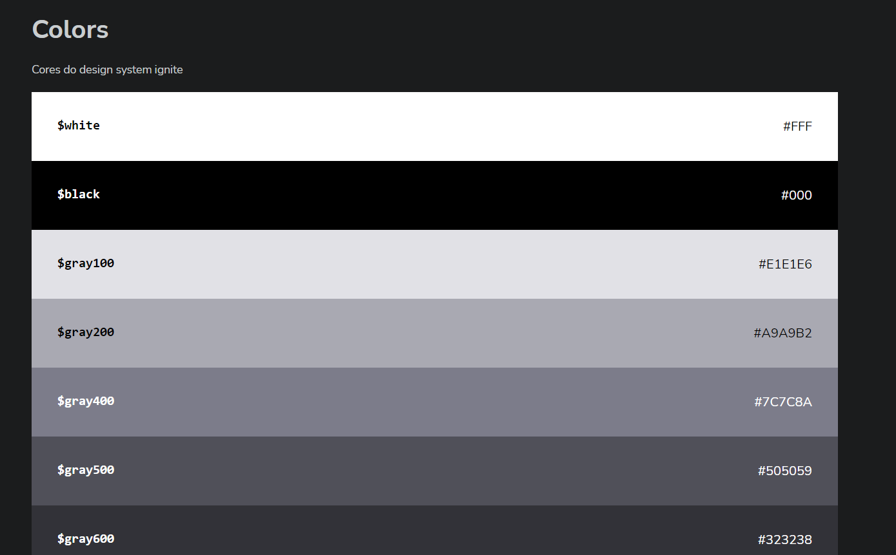
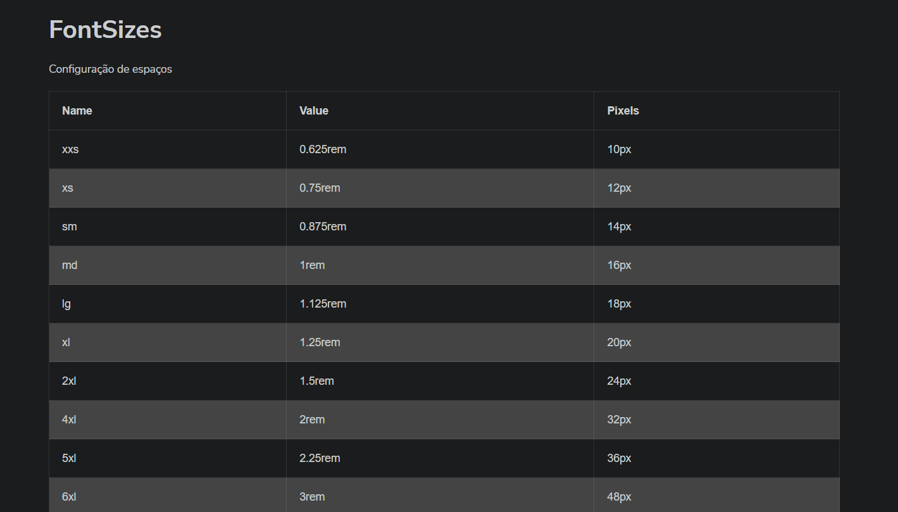
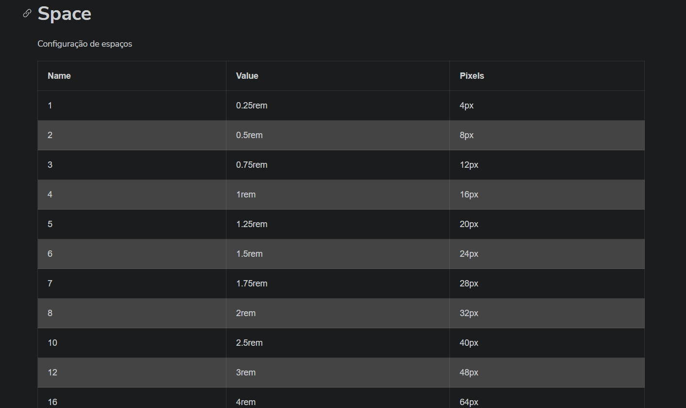
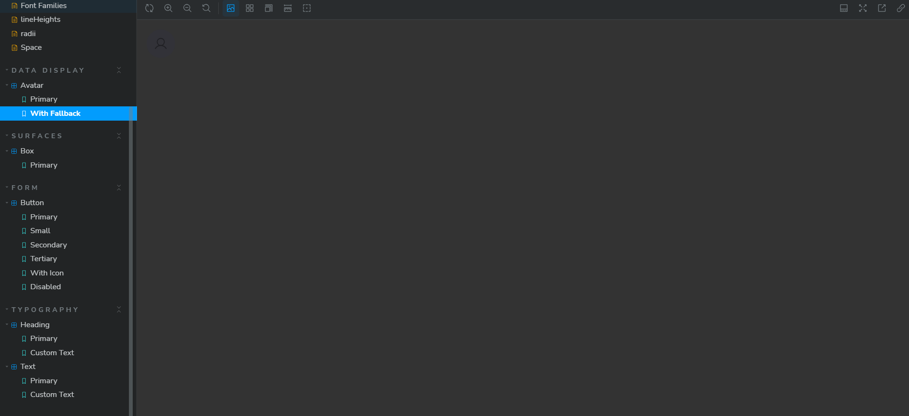
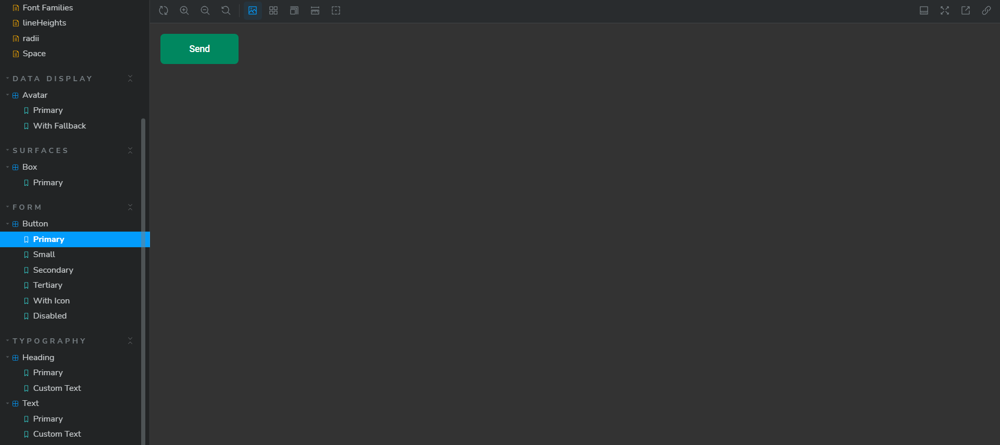
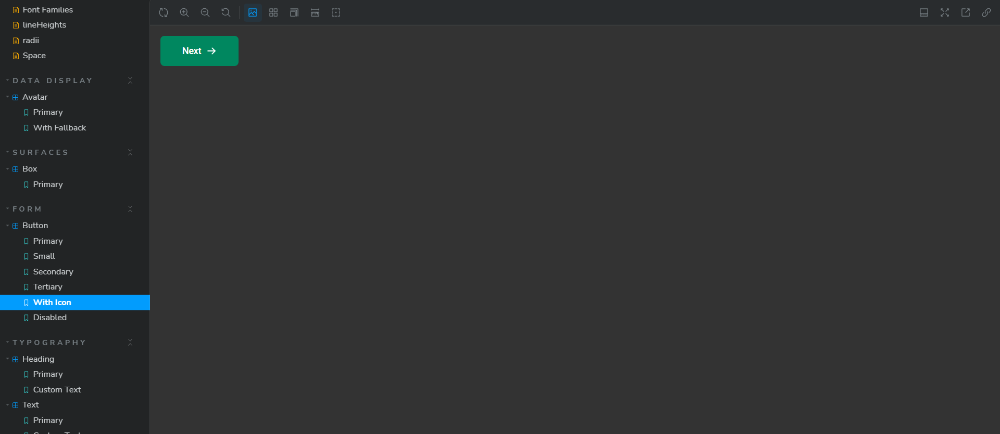
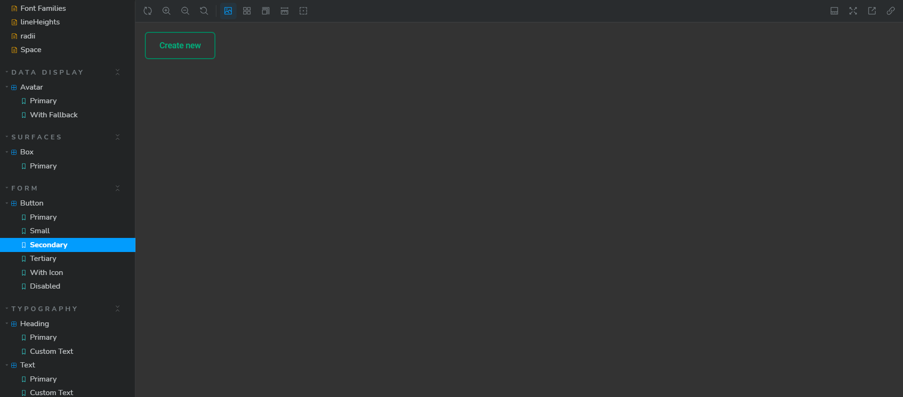

<h1 align="center"> Design System | Storybook </h1>

<p align="center">
  <a href="#-tecnologias">Tecnologias</a>&nbsp;&nbsp;&nbsp;|&nbsp;&nbsp;&nbsp;
  <a href="#-tokens">Tokens</a>&nbsp;&nbsp;&nbsp;|&nbsp;&nbsp;&nbsp;
  <a href="#-data display">Data display</a>&nbsp;&nbsp;&nbsp;|&nbsp;&nbsp;&nbsp;
  <a href="#-button">Button</a>&nbsp;&nbsp;&nbsp;
</p>

<p align="center">
  
</p>

<br>

<p align="center">
  Construção de um design system documentado no Storybook.
</p>

- [Layout no figma](https://www.figma.com/file/3YbR0qS6XhMwbNikCDrK6l/Ignite-Call-(Community)?type=design&mode=design&t=pOYgtMjE5z4ixhCt-0)

<br>

## 🚀 Tecnologias

Esse projeto foi desenvolvido com as seguintes tecnologias:

- ReactJS
- Typescript
- Stitches
- Storybook
- Radix
- Phosphor React

## 🎨 Tokens

A área de tokens armazena todas as configuração de <a href="#-cores">cores</a>, <a href="#-space">espaçamento</a>, <a href="#-fontes">fontes</a>

###  Cores 
  <div align="center">
    
  </div>

  ### Fontes 
  <div align="center">
    
  </div>

  ### Space 
  <div align="center">
    
  </div>

## 🌗 Data display

A área de Data display armazena os estados de avatares.

  ### Online
  <div align="left">
    
  </div>

  ### Offiline
  <div align="left">
    
  </div>


## 🔠 Button

A área de Button armazena os variados estados de botões (normal, hover, com ícone e disabilitado).

<br>
  <div align="left">
    
  </div>

  <br>
  <div align="left">
    
  </div>

<br>
  <div align="left">
    
  </div>


# Comandos importantes

``` npm init -y ```
> inicia um package.json

``` npm i typescript -D ```
> instala o typescript 

``` npm i tsup -D ```
> para converter arquivos em js

``` npm run build ``` 
> gera build de js usando o tsup


``` npx sb init --builder @storybook/builder-vite --type react --use-npm ```
> Inicia o storybook usando o vite de build, usando react e usando npm

``` npx storybook@latest init --builder vite  --type react ```
> Instala a versão mais atual do storybook


Feito com ♥ by Rocketseat 
